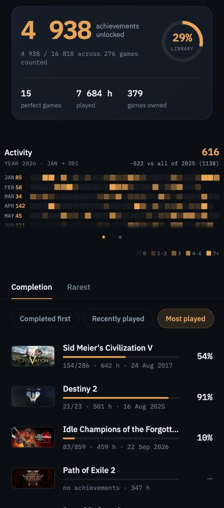
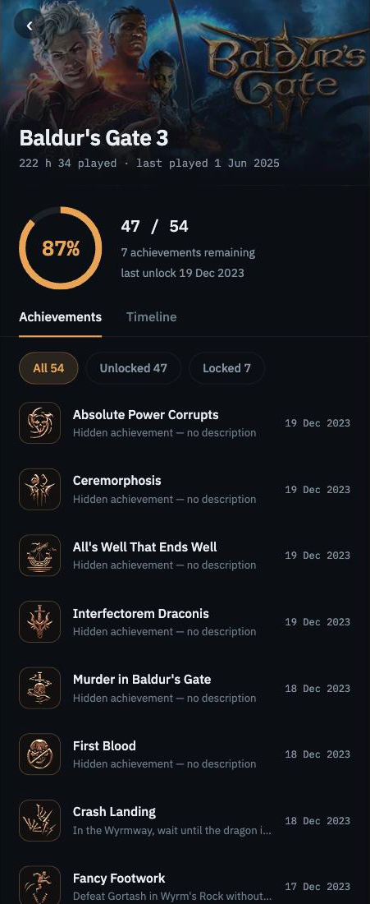

# Steam Achievements

[](https://github.com/Cariboucolas/my-steam-profil/actions/workflows/ci.yml)

Point it at a Steam profile and it says what that profile has actually finished: how many
achievements are unlocked out of how many exist, which games are complete and which are stalled
at ten percent, and when the unlocks happened.

**No account, no sign-in, no password.** You give it a SteamID and it reads the public profile.

<p align="center">
  
  
</p>

## Try it

**In a browser** — <https://steam-achievements-czo.pages.dev> — it is the same app, and it works
on a phone.

You will need a **SteamID64**: seventeen digits, from a public profile. The app asks for one on
first launch and remembers it afterwards.

**On Android**, builds are published over the air to an EAS `preview` channel, but there is no
downloadable APK yet — building one is still a manual step
([#115](https://github.com/Cariboucolas/my-steam-profil/issues/115)). Until then the browser is
the way in. iOS on a real device is out of scope: it needs the Apple Developer Program.

## What it shows

**The library** — every owned game ranked by completion, by how recently it was played, or by
how much. A monthly heatmap of when achievements were unlocked, measured against the previous
year's total. The totals: achievements unlocked, perfect games, hours played.

**A game** — the completion ring, how many achievements remain, when the last one landed, and
the full list filtered by unlocked or locked, each with its date.

## What it does not do

- **There is no sign-in.** That is the point, and it is also the limit: the app sees exactly what
  an anonymous visitor to the Steam profile sees. Signing in with Steam would say *whose* profile
  it is — it would not unlock anything Steam withholds
  ([#97](https://github.com/Cariboucolas/my-steam-profil/issues/97)).
- **A private profile shows nothing.** The API answers 403 and the app says so rather than
  pretending the library is empty.
- **Steam withholds some figures**, playtime in particular, on some profiles. Where it does, the
  app leaves the figure out and says `Steam does not publish` it, rather than showing a zero that
  would read as "never played".

## Running it yourself

```sh
pnpm install
pnpm dev:api                             # the backend, on :3000
pnpm --filter @steam/mobile start        # then `w` for the browser
```

The backend needs a `STEAM_API_KEY` in `apps/api/.env`. Everything else — running it on a real
phone, the four endpoints, what to do when the phone cannot reach Metro — is in
[docs/development.md](docs/development.md).

## Roadmap

- **Download an APK** rather than building one by hand — [#115](https://github.com/Cariboucolas/my-steam-profil/issues/115)
- **Steam sign-in**, and an honest account of what it would and would not recover — [#97](https://github.com/Cariboucolas/my-steam-profil/issues/97)
- **Forget a profile** from inside the app; the code exists and no screen reaches it — [#113](https://github.com/Cariboucolas/my-steam-profil/issues/113)
- **Know whether the deployed site is used at all** — [#121](https://github.com/Cariboucolas/my-steam-profil/issues/121)

## The rest

| | |
| --- | --- |
| [docs/development.md](docs/development.md) | Run it locally: backend, app, a real phone over USB, the network troubleshooting |
| [docs/deployment.md](docs/deployment.md) | Pages, Workers, EAS Update, the switches, where the API key lives |
| [docs/testing.md](docs/testing.md) | The three commands CI runs and the `verify` gate |
| [docs/adr/](docs/adr/) | The decisions, and what each one rejected |
| [CONTEXT.md](CONTEXT.md) | The domain vocabulary the code uses |

Expo / React Native / TypeScript, hexagonal architecture, pnpm monorepo. The design notes live in
`docs/superpowers/`, which is local and not in the repository.
